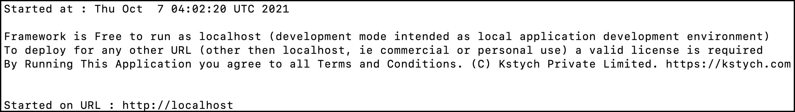

# Getting Started

1. [Installation](#installation)
    - [Meet Kstych](#meet-Kstych)
    - [Why Kstych?](#why-Kstych)
1. [Start the Kstych Framework](#start-the-Kstych-framework)
    - [Initial Setup](#initial-setup)
    - [How to Run Kstych on Windows](#how-to-run-kstych-on-windows)
    - [How to Run Kstych on Linux](#how-to-run-kstych-on-linux)
    - [How to Run Kstych on macOS](#how-to-run-kstych-on-macos)
1. [Next Steps](#next-steps)

- - - -

## Installation

### Meet Kstych

Kstych Low Code Framework is a higher-order framework built on top of Laravel/PHP. It provides developers and business managers a complete low-code environment to start implementing any application by automating all boilerplates. It lets users directly start with business logic, thereby producing 10x efficiency in output.

The Kstych framework is not a "Code Generator"; all configurations are interpreted and executed on the fly and you only write the minimum set of code required for actual business logic. This eliminates a large quantity of code alongside implementing best practices and optimization.

Some of the main objectives of this framework include:

- Entity-Relationships Automation
- MVC Automation
- CRUD Automation
- Workflow Automation
- Convention and Configuration
- Customizable Business logic and UI
- Schema Builder

Advantages of using the Kstych framework

- Focus only on the main idea and functionality of the application
- Push your limits as per the business needs
- Deliver faster results
- Use any frontend stack; plug, and play
- Manage time and resources
- Increased control and transparency to your APIs
- Customized solutions on the go.

Some of the features of the Kstych framework include:

1. Kstych Data Builder works as a stepping stone in building data models as per your system’s requirements.
    - You can define tables, fields, relationships, and use cases within the tables with a wide array of field types.

1. **Autowired MVC:** helps you gain high-level control over where and how Autowiring should be accomplished.
    - Kstych auto wires all routes, models, and controllers for you to ensure you have a hassle-free experience while building your applications.

1. **Powerful Workflow Engine:** one of the key requirements for any application developer is to have a powerful workflow engine that helps manage all the business processes.
    - Kstych provides a UI-enabled, drag-drop interface that facilitates an effortless flow of information between tasks, events, and the database.
    - With the intuitive visual design, you can readily modify or make changes to the application as per the client’s need.

### Why Kstych?

The purpose of the Kstych framework is to reduce the boilerplate code by replacing the fragility of manually defining monotonous routings, controllers, model definitions, etc. Using the Kstych framework you can get rid of memorizing the annotations at the Controller or method levels.

## Start the Kstych Framework

### Initial Setup

You can run your Kstych application using <a href="https://www.docker.com/" target="_blank">Docker</a>.

Docker is a tool for running applications and services in small, light-weight "containers" which do not interfere with your local computer's installed software or configuration. This means you don't have to worry about configuring or setting up complicated development tools such as web servers and databases on your personal computer. To get started, you only need to install <a href="https://www.docker.com/products/docker-desktop" target="_blank">Docker Desktop</a>.

<!--<aside class="note"><b>Note:</b>You must also have <a href="https://git-scm.com/book/en/v2/Getting-Started-Installing-Git" target="_blank">GIT</a> installed on your machine.
</aside>-->

### How to Run Kstych on Windows

To run Kstych on Windows, <a href="https://docs.docker.com/desktop/windows/install/" target="_blank">Install Docker Desktop on Windows with WSL 2 backend</a>, and run the following commands in the Windows Powershell:

1. Pull the following docker images:

        docker pull kstych/framework
        docker pull mariadb

1. Start the MariaDB server using the following command:

        docker run --name mariadb -e MARIADB_ROOT_PASSWORD=yb9738z -p 3306:3306 mariadb

1. Create a working directory for the Kstych application and change to that directory.

        mkdir kstych
        cd kstych

1. Create the following directories:

        mkdir -p data/custom
        mkdir -p data/var/lib/mysql
        mkdir -p data/etc/letsencrypt

1. Run docker using the following command:

        docker run --rm -it --shm-size=2gb --name=kstych-framework -v ${PWD}/data/var/lib/mysql:/var/lib/mysql:Z  -v ${PWD}/data/custom:/home/Kstych/Framework/custom:Z -v ${PWD}/data/etc/letsencrypt:/etc/letsencrypt:Z -p 80:80 -p 443:443 -e KSTYCH_LICENSE="localhost" -e KSTYCH_DOMAIN="localhost" -e KSTYCH_IP="127.0.0.1" kstych/framework

    

1. Open your browser and type `http://localhost` in the browser search bar. You would be prompted with the LoginID and Password. Log in using `admin` and `yb9738z` as the default credentials.

    

### How to Run Kstych on Linux

If you're developing a Kstych application on Linux and <a href="https://docs.docker.com/engine/install/ubuntu/" target="_blank">Docker</a> is already installed, you can use a simple terminal command to create a new Kstych project. For the demonstration, let's create a simple "Blog application" in the directory named `BlogPost`.

1. Run the stand-alone docker image using the following commands:

        git clone https://github.com/Kstych/framework
        sudo su
        cd framework

1. Run the `Kstych.sh` script file and wait for the server to start.

        ./Kstych.sh

1. Once the server is started, you would see an output similar to the following:

    

1. Open your browser and type `http://localhost` in the browser search bar. You would be prompted with the LoginID and Password. Log in using `admin` and `yb9738z` as the default credentials.

    

### How to Run Kstych on macOS

If you're developing a Kstych application on macOS and <a href="https://docs.docker.com/engine/install/ubuntu/" target="_blank">Docker</a> is already installed, you can use a simple terminal command to create a new Kstych project. For the purpose of the demonstration, let's create a simple "Blog application" in the directory named `BlogPost`.

1. Run the following commands in your terminal:

        git clone https://github.com/Kstych/framework
        sudo su
        cd framework

1. Ensure that the Kstych framework is running in your Docker dashboard.

    

1. Run the `Kstych.sh` script file and wait for the server to start.

        ./Kstych.sh

1. Once the server is started, you would see an output similar to the following:

    

1. Open your browser and type `http://localhost` in the browser search bar. You would be prompted with the LoginID and Password. Log in using `admin` and `yb9738z` as the default credentials.

    

## Next Steps

Now that you have started the Kstych framework, it is recommended that you become familiar with how Laravel works, as the Kstych framework is built on Laravel.

Following Laravel documentation would help you kick start building your first Kstych application.

- <a href="https://laravel.com/docs/8.x/lifecycle" target="_blank">Request Lifecycle</a>
- <a href="https://laravel.com/docs/8.x/configuration" target="_blank">Configuration</a>
- <a href="https://laravel.com/docs/8.x/structure" target="_blank">Directory Structure</a>

